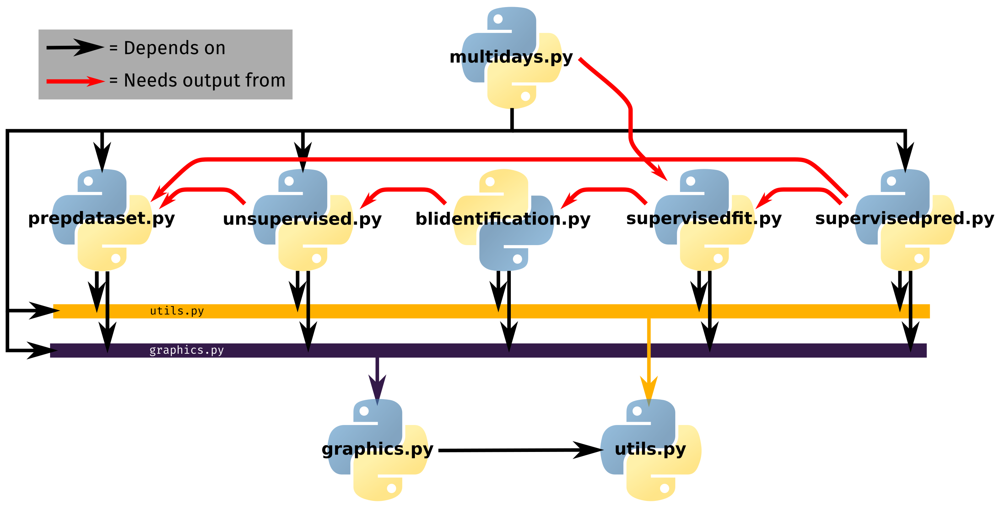

BLUSC: atmospheric Boundary Layer Unsupervised and Supervised Classification
===================================

What is BLUSC ?
-----------------
BLUSC is a free software to perform supervised and unsupervised atmospheric boundary layer classification from synergistic set of ground-based remote sensing measurements.
So far, it uses only backscatter profiles (measured by aerosol lidars or ceilometers) and temperature profiles (measured by microwave radiometers).
It returns quicklooks of boundary layer features identified in the classification (mixed layer, clouds, etc.)


How to use it?
---------------
The BLCovid package can be installed by following the **installation instructions below**.
Once installed, you will find ready-to-use scripts in the `examples` directory.
Tutorial dedicated to different steps of the program can be found in Jupyter notebook in the `notebooks` directory.


Contacts
---------
This software is edited by Meteo-France.
  * Thomas Rieutord (CNRM) : thomas.rieutord@meteo.fr

Licence
--------
This software is under [CeCILL](https://cecill.info/licences.en.html) licence (open source, French equivalent to GNU/GPL licence).
Terms are in the LICENCE.txt file.

Installation
=============

Installing dependencies
------------------------

### With Conda (recommended)
Conda is a package manager very helpful in Python.
If you do not have `conda`, you can download it [here](https://docs.conda.io/projects/conda/en/latest/index.html).

The advantage of using `conda` the way described here is to isolate the python configuration needed for BL classification from the rest your current configuration.

```bash
conda env create -f condaenv.yml
conda activate test_blusc               # Enter this environment
```

Now the text "(test_blusc)" should appear before your prompt

### With pip
For an installation with `pip`, follow these instructions:

```bash
pip install -r requirements.txt 
```

Installing the BLUSC package
---------------------------
This can be done only with `pip`.
In the directory where is the `setup.py`, run:
```bash
pip install -e .
```

Use BLUSC 
---------
Once the installation is ready (prompt should display `(test_blusc)` if you are using conda), you can execute the ready-to-use script in the `examples` directory.
For example, to execute data preparation and unsupervised classification run:
```bash
python try_unsupervised_classification.py
```
Such programs are volontarily short and call self-documented functions.

If some of your tests do not work because of missing file, run the shell script `run_tests.sh` in the directory `blusc/`.
It will create an example of file needed for all steps of the program.
Such example files are usually put as default values in the settings.


More information about the package and its parameters are given below.

The package
============

Repository organisation
---------------
The repository is organised in 4 directories:
  * `blusc` contains the source code of the package
  * `examples` contains ready-to-use examples of boundary layer classification
  * `notebooks` contains the Jupyter notebook serving as tutorial for each step of the program
  * `working-directories` contains the intermediate directories required to store inputs/outputs of differents codes

The following figure shows the role of each directories as well as data fluxes:


Source code description
---------------

BLUSC package is located in the `blcovid` directory. It contains 8 Python source codes :
  * `prepdataset.py`: module to prepare the original data for the classification.
  * `unsupervised.py`: module to make unsupervised classification of a prepared dataset.
  * `blidentification.py`: user-interactive program to identify the boundary layer features generated by unsupervised classification.
  * `supervisedfit.py`: module to train supervised classifier from identified boundary layer features.
  * `supervisedpred.py`: module to make supervised classification of a prepared dataset.
  * `graphics.py`: module containing all graphics.
  * `utils.py`: module containing basic functions used in more than one module.

Here is the dependency graph:




Automatic classification
---------------

As you may have notice, one of the source code (`blidentification.py`) requires human supervison.
As a consequence, it cannot be included into an automatic classification.
Two paths are automatic: the unsupervised path (prepare the data and classify without supervision) and the supervised path (prepare the data and use a previously trained classifier).
They are summarized by the following figure:


